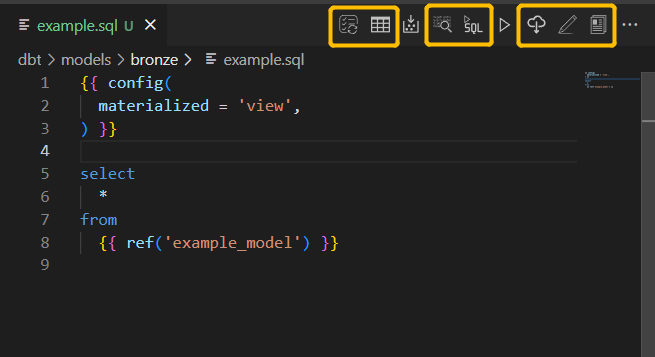

# vscode-dbt-databricks-power-user


This extension makes vscode work with [dbt](https://www.getdbt.com/) and [Databricks](https://databricks.com/) (It should also work with other providers like `BiqQuery`, but I haven't got chance to test other providers, so let me know how you go if you have tried :) ) This extension is a fork on the [vscode-dbt-power-user](https://github.com/innoverio/vscode-dbt-power-user) extension made by Innoverio, 
and the [vscode-dbt-bigquery-power-user](https://github.com/butchland/vscode-dbt-bigquery-power-user) made by Butchland. 

In addition to the [existing functions](https://github.com/innoverio/vscode-dbt-power-user/blob/master/README.md) (e.g.  **Compile Current Model**,  **Run Current Model**) of the `vscode-dbt-power-user`, the following seven functions have been added via the buttons on the active windows (See below for the added functions/buttons).


*  **List models** - runs 'dbt list' to lists resources in your dbt project. It updates the model nodes tree when your update your model. A default `dbt.listModelsDisabled` flag can be set in the extension setup to enable/disable automatic listing of models when files change. If auto-list is disabled (which I personally prefer), this button here can be handy.
*  **Preview Current Model** - uses the compiled SQL to preview the table without materializing it on the cloud. Note: this operation triggers a DBT re-compiling first. If you don't need to recompile, you can user 'Show Compiled' and 'Run SQL As-is'
*  **Show Compiled** - opens the compiled sql version of the model (inherited from Butchland's work)
*  **Run SQL As-Is** - run the 'as-is' (i.e. even the unsaved code) SQL from current active window. For example, it can be used on the compiled code or be used like a query editor, but very likely it won't work on the model window as it doesn't compile codes like '`{{ ref('example_model') }}`'.
*   **Get Current Model from Cloud** - fetch the data from the materialized table/view from the cloud using `'SELECT * FROM example_model_table LIMIT 25'` query
*   **Generate DBT Docs** - generate the DBT documents
*   **View DBT Docs** - serve and view the generated DBT documents in a web browser.





The `vscode-dbt-databricks-power-user` extension is a drop-in replacement for `vscode-dbt-power-user` and  uses the same config. 


## Troubleshoot when the buttons are not shown


You should associate your .sql files with the jinja-sql language by configuring in Preferences > Settings


or add the following in settings.json:

```
    "files.associations": {
        "*.sql": "jinja-sql"
    },
```
