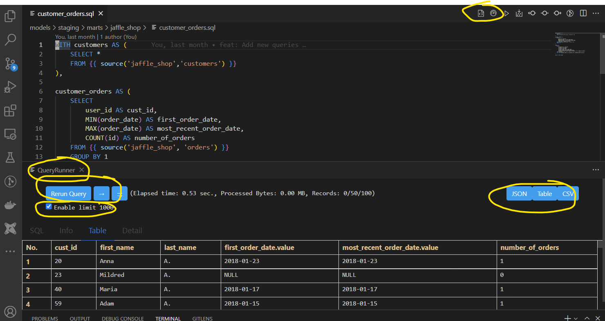

# vscode-dbt-bigquery-power-user

This extension makes vscode seamlessly work with [dbt](https://www.getdbt.com/) and Biq Query
This extension is a fork of and extensively based on the [vscode-dbt-power-user](https://github.com/innoverio/vscode-dbt-power-user) extension made by Innoverio and adds
a *preview sql* command that compiles (if not updated) the model and runs the compiled sql
on BigQuery. 
The Big Query integration uses code based on the [vscode-big-query](https://github.com/google/vscode-bigquery) extension but has been extensively modified. 

The vscode-dbt-bigquery-power-user extension is a drop-in replacement for vscode-dbt-power-user and
is incompatible with concurrent usage (as they use the same config and registered commands). 

On the other hand, you can still install the [vscode-bigquery](https://github.com/google/vscode-bigquery) extension (and use the same config) which will allow you to run BigQuery sql queries on compiled dbt sql files.

The preview sql extension was forked and extensively modified from the [vscode-query-runner](https://github.com/tadyjp/vscode-query-runner) project
which hasn't been updated in three years.

See below for a look of the added Preview SQL pane.

The highlights of this extension are:
* A **Show Compiled SQL** menu icon that opens the compiled sql version of your models
* An **Open Query Runner** menu icon that runs the compiled sql and displays the results in another panel
* The **Query Runner** panel that displays the results of the query. 
   - The **Rerun Query** button which allows you to update the model in your original panel and rerun the query (including the compilation) as well as the **Results navigation** buttons to see the next/prev page of results. 
   - The **Download** buttons which allow to display the results  (with a choice of JSON, text, or csv formats)  as well as download the data into the `logs/results` folder of the dbt-project.
   - (**new in version 0.5.20**) An automatic limit clause that can be configured to default to _true_ or _false_ and the default limit amount can
   also be changed (default value: 10000). Unchecking the checkbox and rerunning the query will run the query without the limit clause. _(Note: this limit does not apply to the download buttons)_
* **Also fixed for in 0.5.20**: Checking, installing, and upgrading the dbt package now works with the latest versions of dbt. 